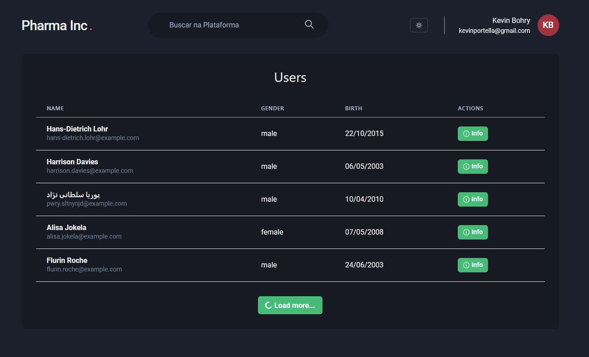
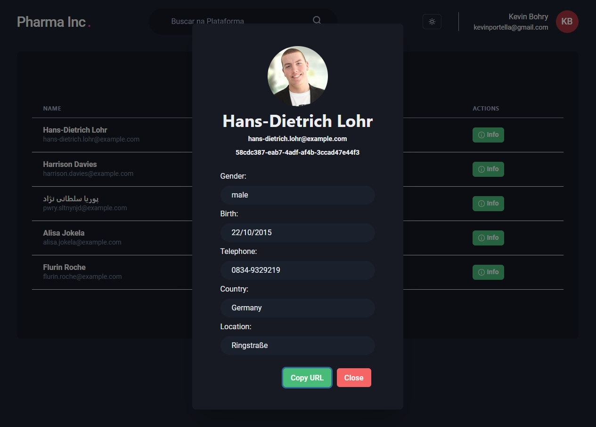

<p align="center">
  <h1>Dash Users</h1>
</p>

<h1 align="center">
  
  
</h1>

## Sobre: 

Dash Users é o projeto de uma dashboard de controle de usuários onde você pode acessar cada usuário separadamente para obter mais informações sobre eles.

Esse foi um desafio proposto pela [coodesh](https://lab.coodesh.com/public-challenges/front-end-challenge-2021).

## Tecnologias:

Este projeto foi desenvolvido com as seguintes tecnologias: 

- [React](https://reactjs.org)
- [NextJs](https://nextjs.org)
- [TypeScript](https://www.typescriptlang.org/)
- [ChakraUI](https://chakra-ui.com)

## Como Usar:

Clone o projeto e acesse o arquivo.

```bash
$ git clone https://github.com/kevinportella/dashUsers
$ cd dashUsers
```

Para iniciá-lo, siga as etapas abaixo: 
```bash
# Install dependencies
$ yarn

# Start the project 
$ yarn start
```

## License:

Este projeto está sob a licença do MIT. Veja o arquivo [LICENSE](LICENSE.md) para mais detalhes.

---

By Kevin Portella 👋🏽 [Contact](https://www.linkedin.com/in/kevin-bohry-58a4614b/)
